#  Hi there, I'm Yashvardhan Shekhar! 

<div align="center">
  
</div>

<div align="center">
  
</div>

<div align="center">
  
  
  
</div>


## 🚀 About Me


```javascript
const yashvardhan = {
    name: "Yashvardhan Shekhar",
    role: "Full Stack Developer 💻",
    location: "India 🇮🇳",
    workingOn: "Something amazing... 🔥",
    learning: ["Advanced React Patterns", "WebAssembly", "AI/ML"],
    askMeAbout: ["Web Dev", "Mobile Apps", "3D Graphics"],
    funFact: "I debug with console.log() and I'm proud of it! 😄",
    motto: "Code is poetry written in logic ✨"
};

// Life loop
while(alive) {
    eat();
    sleep();
    code();
    repeat();
}
```

<div align="center">
  
</div>


## 🛠️ Tech Arsenal

<div align="center">
  
</div>

### 🎨 Languages
<div align="center">
<p>
 


 
  
    
  
</p>
</div>

### 📱 Development
<div align="center">
<p>  
  

  
  
  
  
 
  
  
  
  
  
  
  
</p>
</div>


## 📊 GitHub Analytics

<div align="center">
  
</div>

<div align="center">
  
  
</div>

<div align="center">
  
</div>

<div align="center">
  
</div>


## 🎯 Current Mission

```mermaid
%%{init: {'theme':'dark', 'themeVariables': {'primaryColor':'#ff6b6b', 'primaryTextColor':'#ffffff', 'primaryBorderColor':'#ff6b6b', 'lineColor':'#45b7d1', 'secondaryColor':'#4ecdc4', 'tertiaryColor':'#f8d866'}}}%%
graph TD
    A[🚀 Full Stack Mastery] --> B[📱 Mobile Revolution]
    A --> C[🌐 Web Innovation]
    A --> D[☁️ Cloud Domination]
    B --> E[React Native Apps]
    B --> F[Cross-Platform Magic]
    C --> G[Next.js Wizardry]
    C --> H[3D Web Experiences]
    D --> I[Firebase Integration]
    D --> J[Vercel Deployment]
    
    style A fill:#ff6b6b,stroke:#ffffff,stroke-width:2px,color:#ffffff
    style B fill:#4ecdc4,stroke:#ffffff,stroke-width:2px,color:#ffffff
    style C fill:#45b7d1,stroke:#ffffff,stroke-width:2px,color:#ffffff
    style D fill:#f8d866,stroke:#ffffff,stroke-width:2px,color:#000000
```

<div align="center">
  
</div>

<div align="center">



</div>


## 🌟 Project Showcase

<div align="center">
  
</div>

<table align="center">
<tr>
<td width="50%">

### 🚀 E-Commerce Platform


*A full-stack e-commerce solution with real-time inventory, payment integration, and admin dashboard.*

</td>
<td width="50%">

### 📱 Banking Mobile App


*Secure mobile banking app with biometric authentication and real-time transactions.*

</td>
</tr>
<tr>
<td width="50%">

### 🎮 3D Web Experience


*Immersive 3D web game with physics engine and multiplayer capabilities.*

</td>
<td width="50%">

### 🌐 Portfolio Website


*Interactive portfolio with smooth animations and modern design.*

</td>
</tr>
</table>


## 🎨 Skills Radar

<div align="center">
  
</div>

<div align="center">

```
📱 React Native Development  ████████████████░░░░   95%  
⚙️ Backend Development      █████████████░░░░░░░   67%  
🎨 Frontend Development      ████████████░░░░░░░░   75%  
🎯 UI/UX Design              ███████████░░░░░░░░░   70%  
🗄️ Database Management      ███████████░░░░░░░░░   80%

```

</div>


## 🤝 Let's Connect & Collaborate!

<div align="center">
  
</div>

<div align="center">
  <a href="mailto:your.email@example.com">
    
  </a>
  <a href="https://linkedin.com/in/yashvardhanshekhar">
    
  </a>
  <a href="https://leetcode.com/u/YashvardhanShekhar">
   

  </a>
  <a href="https://yashvardhanshekhar.dev">
    
  </a>
</div>


 
</div>


## 💭 Daily Inspiration

<div align="center">
  
</div>

<div align="center">
  
</div>


## 🐍 Contribution Snake

<div align="center">
  
</div>

<div align="center">
  
</div>

---

<div align="center">
  
### 🔥 *"Building digital dreams, one line of code at a time"* 🔥


---

*Made with ❤️, lots of ☕, and endless curiosity*

</div>
